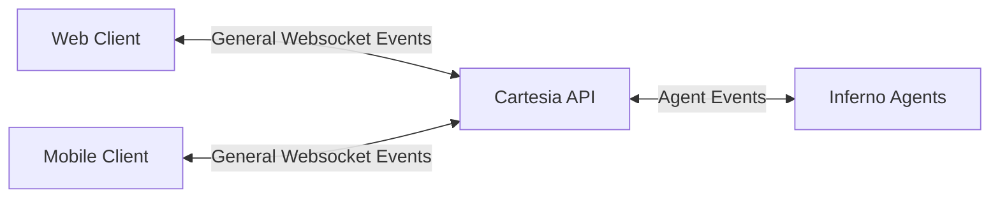

# Web & Mobile Clients

Some Cartesia customers might be interested in integrating their Line agents with their web or mobile application, rather than a telephony provider. For these folks, the Agents WebSocket provides real-time, bidirectional communication with voice agents through a streaming interface. This allows you to send audio data and receive agent responses in real-time for any client.



## Connection

Connect to the WebSocket endpoint:

```
wss://api.cartesia.ai/agents/stream/{agent_id}
```

**Headers:**
- `Authorization: Bearer {your_api_key}`
- `Cartesia-Version: 2025-04-16`

## Protocol Overview

The WebSocket protocol uses JSON messages for control and base64-encoded audio for media. The connection follows this flow:

1. Client sends `start` event to initialize the stream
2. Server responds with `ack` event confirming configuration
3. Bidirectional exchange of events
4. Connection closes using WebSocket close frames

Note that if you don't specify `stream_id` in the initial `start` message, one will be assigned and returned in the `ack` response.

## Input Events (Client → Server)

### Start Event

Initializes the audio stream configuration. **This must be the first message sent.**

```json
{
  "event": "start",
  "stream_id": "example_id",
  "config": {
    "input_format": "pcm_44100",
    "output_format": "pcm_44100"
  }
}
```

**Fields:**
- `stream_id` (optional): Stream identifier. If not provided, server generates one
- `config.input_format`: Audio format for client audio input (`mulaw_8000`, `pcm_16000`, `pcm_24000`, `pcm_44100`)
- `config.output_format`: Audio format for server audio output (`mulaw_8000`, `pcm_16000`, `pcm_24000`, `pcm_44100`)

### Media Event

Sends audio data to the agent.

```json
{
  "event": "media",
  "stream_id": "example_id",
  "media": {
    "payload": "base64_encoded_audio_data"
  }
}
```

**Fields:**
- `stream_id`: Stream identifier from the ack response
- `media.payload`: Base64-encoded audio data in the format specified in the start event

### DTMF Event

Sends DTMF (dual-tone multi-frequency) tones.

```json
{
  "event": "dtmf",
  "stream_id": "example_id",
  "dtmf": "1"
}
```

**Fields:**
- `stream_id`: Stream identifier
- `dtmf`: DTMF digit (0-9, *, #)

### Custom Event

Sends custom metadata to the agent.

```json
{
  "event": "custom",
  "stream_id": "example_id",
  "metadata": {
    "user_id": "user123",
    "session_info": "custom_data"
  }
}
```

**Fields:**
- `stream_id`: Stream identifier
- `metadata`: Object containing key-value pairs of custom data

## Output Events (Server → Client)

### Ack Event

Server acknowledgment of the start event, confirming stream configuration.

```json
{
  "event": "ack",
  "stream_id": "example_id",
  "config": {
    "input_format": "pcm_44100",
    "output_format": "pcm_44100"
  }
}
```

### Media Event

Server sends agent audio response.

```json
{
  "event": "media",
  "stream_id": "example_id",
  "media": {
    "payload": "base64_encoded_audio_data"
  }
}
```

### Clear Event

Indicates the agent wants to clear/interrupt the current audio stream.

```json
{
  "event": "clear",
  "stream_id": "example_id"
}
```

### DTMF Event

Server sends DTMF tones from the agent.

```json
{
  "event": "dtmf",
  "stream_id": "example_id",
  "dtmf": "5"
}
```

### Custom Event

Server sends custom metadata from the agent.

```json
{
  "event": "custom",
  "stream_id": "example_id",
  "metadata": {
    "agent_state": "processing",
    "confidence": 0.95,
    "custom_data": "value"
  }
}
```

## Connection Management

### Ping/Pong Keepalive

The WebSocket supports standard ping/pong frames for periodic connection healthchecks:

```python
# Client sends ping
pong_waiter = await websocket.ping()
latency = await pong_waiter
```

The server automatically responds to ping frames with pong frames.

### Connection Close

The connection can be closed by either the client or server using WebSocket close frames.

**Client-initiated close:**
```python
await websocket.close(code=1000, reason="session completed")
```

**Server-initiated close:**
When the agent ends the call, the server closes the connection with:
- **Code:** 1000 (Normal Closure)
- **Reason:** `"call ended by agent"` or `"call ended by agent, reason: {specific_reason}"` if additional context is available

## Best Practices

1. **Always send start event first** - The connection will be closed if any other event is sent before start
2. **Use appropriate audio formats** - Match your input format to your audio source capabilities. For telephony providers this is often MULAW 8k, while for web clients this will often be 44.1k
3. **Handle connection close gracefully** - Monitor close events and reasons for debugging
4. **Implement ping/pong for long connections** - Use WebSocket ping frames to periodically confirm connection health
5. **Monitor stream_id consistency** - Maintain your own stream_id's for the best observability
