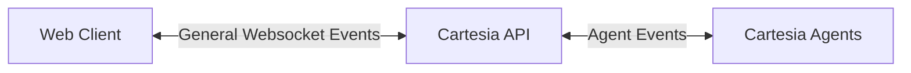

# Web Calls

The Agents WebSocket provides real-time, bidirectional communication between web clients and Cartesia voice agents. It enables streaming audio input and real-time agent responses for browser-based or custom applications.



## Connection

Connect to the WebSocket endpoint:

```
wss://api.cartesia.ai/agents/stream/{agent_id}
```

**Headers:**
- `Authorization: Bearer {your_api_key}`
- `Cartesia-Version: 2025-04-16`

## Protocol Overview

The WebSocket protocol uses JSON messages for control and base64-encoded audio for media. The connection follows this flow:

1. Client sends `start` event to initialize the stream
2. Server responds with `ack` event confirming configuration
3. Bidirectional exchange of events
4. Connection closes using WebSocket close frames

Note that if you don't specify `stream_id` in the initial `start` message, one will be assigned and returned in the `ack` response.

## Input Events (Client → Server)

### Start Event

Initializes the audio stream configuration. 
- The `config` parameter will optionally alter the input audio settings, overriding what your default agent configuration might otherwise be
- The `stream_id` can be set manually if you wish to maintain this on the client end for observability purposes. If not specified, we'll generate one and return it in the `ack` event

**This must be the first message sent.**

```json
{
  "event": "start",
  "stream_id": "unique_id",
  "config": {
    "input_format": "pcm_44100"
  },
  "metadata": {
    "to": "user@example.com",
    "from": "+1234567890"
  }
}
```

**Fields:**
- `stream_id` (optional): Stream identifier. If not provided, server generates one
- `config.input_format`: Audio format for client audio input (`mulaw_8000`, `pcm_16000`, `pcm_24000`, `pcm_44100`)
- `metadata` (optional): Custom metadata object. These will be passed through to the user code, but there are some special fields you can use as well:
  - `to` (optional): Destination identifier for call routing (defaults to agent ID)
  - `from` (optional): Source identifier for the call (defaults to "websocket")

### Media Input Event

Audio data sent from the client to the server. `payload` audio data should be base64 encoded.

```json
{
  "event": "media_input",
  "stream_id": "example_id",
  "media": {
    "payload": "base64_encoded_audio_data"
  }
}
```

**Fields:**
- `stream_id`: Stream identifier from the ack response
- `media.payload`: Base64-encoded audio data in the format specified in the start event

### DTMF Event

Sends DTMF (dual-tone multi-frequency) tones.

```json
{
  "event": "dtmf",
  "stream_id": "example_id",
  "dtmf": "1"
}
```

**Fields:**
- `stream_id`: Stream identifier
- `dtmf`: DTMF digit (0-9, *, #)

### Custom Event

Sends custom metadata to the agent.

```json
{
  "event": "custom",
  "stream_id": "example_id",
  "metadata": {
    "user_id": "user123",
    "session_info": "custom_data"
  }
}
```

**Fields:**
- `stream_id`: Stream identifier
- `metadata`: Object containing key-value pairs of custom data

## Output Events (Server → Client)

### Ack Event

Server acknowledgment of the start event, confirming stream configuration.
If `stream_id` wasn't provided in the initial `start` event, this is where the user can obtain the server generated `stream_id`.

```json
{
  "event": "ack",
  "stream_id": "example_id",
  "config": {
    "input_format": "pcm_44100"
  }
}
```

### Media Output Event

Server sends agent audio response. `payload` is base 64 encoded audio data.

```json
{
  "event": "media_output",
  "stream_id": "example_id",
  "media": {
    "payload": "base64_encoded_audio_data"
  }
}
```

### Clear Event

Indicates the agent wants to clear/interrupt the current audio stream.

```json
{
  "event": "clear",
  "stream_id": "example_id"
}
```

### DTMF Event

Server sends DTMF tones from the agent.

```json
{
  "event": "dtmf",
  "stream_id": "example_id",
  "dtmf": "5"
}
```

### Custom Event

Server sends custom metadata from the agent.

```json
{
  "event": "custom",
  "stream_id": "example_id",
  "metadata": {
    "agent_state": "processing",
    "confidence": 0.95,
    "custom_data": "value"
  }
}
```

## Connection Management

### Inactivity Timeout

The server automatically closes idle WebSocket connections after **30 seconds** of inactivity. Activity is defined as receiving any message from the client, including:

- Application messages (media_input, dtmf, custom events)
- Standard WebSocket ping frames
- Any other valid WebSocket message

When the timeout occurs, the connection is closed with:
- **Code:** 1000 (Normal Closure)
- **Reason:** `"connection idle timeout"`

### Ping/Pong Keepalive

To prevent inactivity timeouts during periods of silence, use standard WebSocket ping frames for periodic keepalive:

```python
# Client sends ping to reset inactivity timer
pong_waiter = await websocket.ping()
latency = await pong_waiter
```

```javascript
// JavaScript example
setInterval(() => {
  if (websocket.readyState === WebSocket.OPEN) {
    websocket.ping();
  }
}, 20000); // Send ping every 20 seconds
```

The server automatically responds to ping frames with pong frames and resets the inactivity timer upon receiving any message.

### Connection Close

The connection can be closed by either the client or server using WebSocket close frames.

**Client-initiated close:**
```python
await websocket.close(code=1000, reason="session completed")
```

**Server-initiated close:**
When the agent ends the call, the server closes the connection with:
- **Code:** 1000 (Normal Closure)
- **Reason:** `"call ended by agent"` or `"call ended by agent, reason: {specific_reason}"` if additional context is available

## Best Practices

1. **Always send start event first** - The connection will be closed if any other event is sent before start
2. **Use appropriate audio formats** - Match your input format to your audio source capabilities. For telephony providers this is often MULAW 8k, while for web clients this will often be 44.1k
3. **Handle connection close gracefully** - Monitor close events and reasons for debugging
4. **Implement keepalive for calls with longer periods of silence** - Send WebSocket ping frames every 20-25 seconds to prevent the 30-second inactivity timeout during periods of silence
5. **Monitor stream_id consistency** - Maintain your own stream_id's for the best observability
6. **Prepare for timeout closures** - Handle `"connection idle timeout"` close reasons gracefully in your reconnection logic
