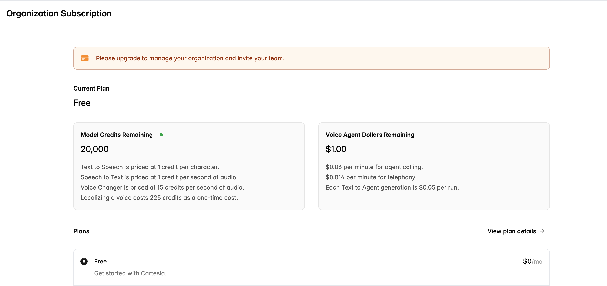
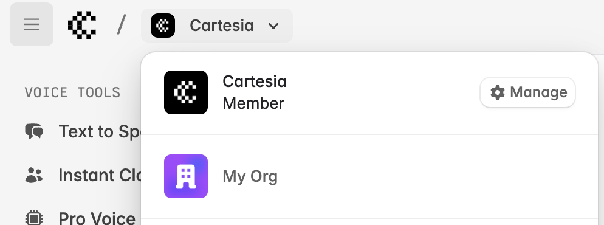
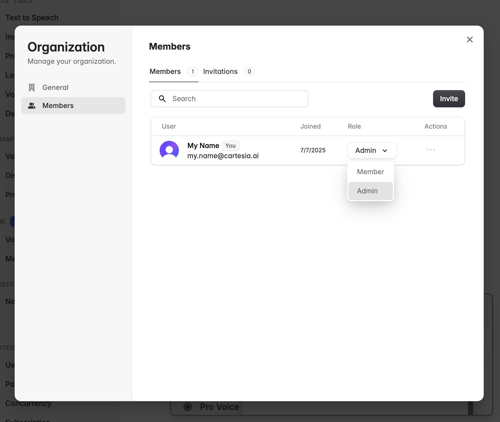
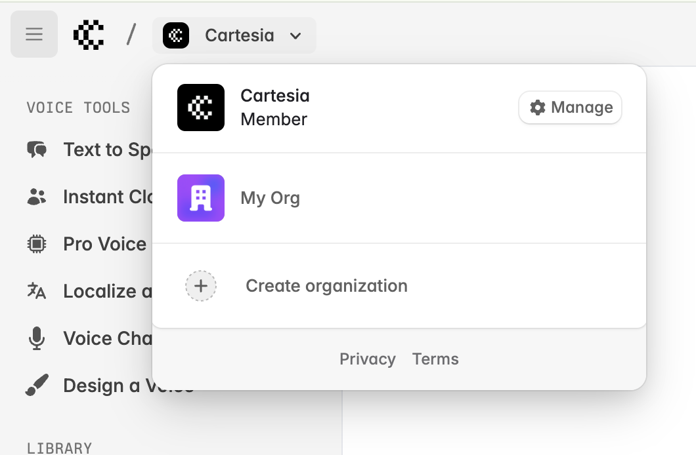
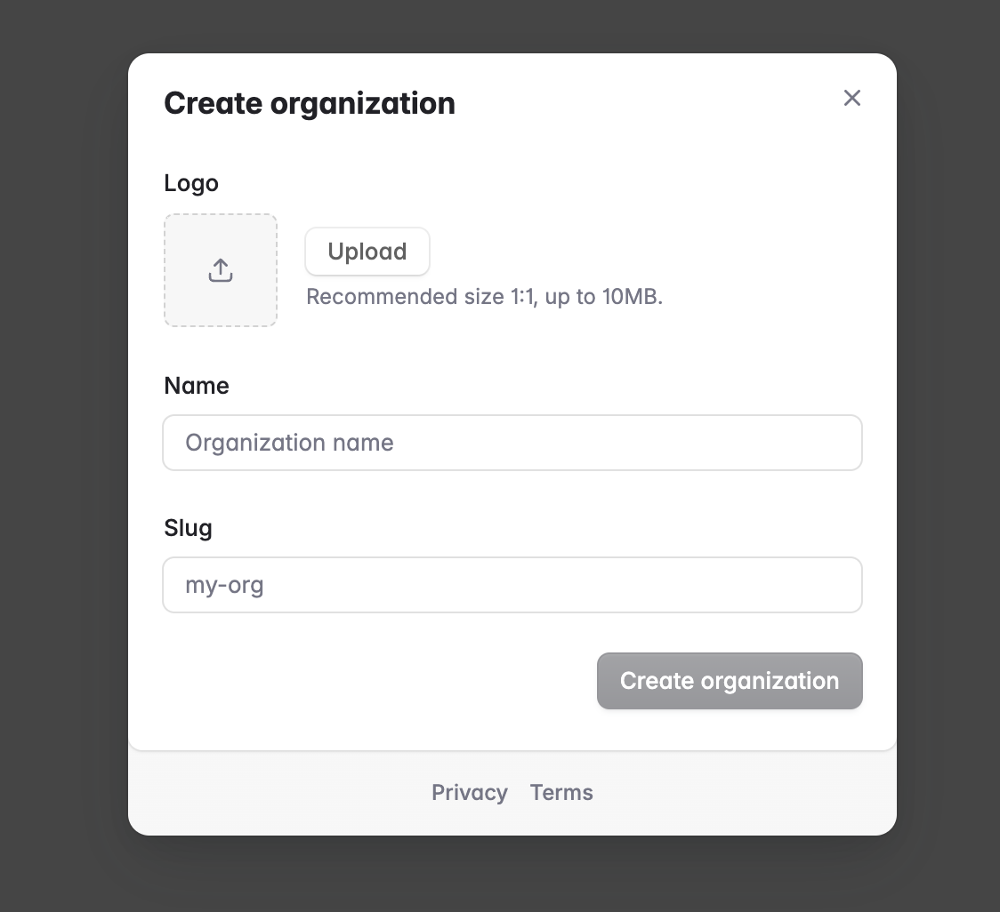

Organization workspaces enable seamless collaboration between multiple team members. All users in an organization share the same view of resources, including voices, API keys, and datasets. The only exceptions are playground generation history and starred voices, which remain private to each individual user.

By default, your Cartesia account initializes as an organization workspace on the Free subscription plan.

<Warning>
  To invite team members, you must first upgrade your organization to the
  Startup tier or higher. After upgrading, you can invite unlimited users at no
  additional cost.
</Warning>

## Manage your organization

<Steps>

### Upgrade your current organization

Organizations must be upgraded to the Startup tier or above before team members can be invited. Each workspace has its own billing and credit limits, so make sure you are on the intended organization before proceeding to upgrade your subscription.

<Frame background="subtle">
  
</Frame>

### Invite your team

Once you've upgraded your organization, you can use the "Manage" button in the workspace switcher to manage it:

<Frame background="subtle">
  
</Frame>

This pops up a modal where you can change your profile and invite your team:

<Frame background="subtle">
  
</Frame>

There are two membership types in an organizaton:

1. Admin: has the ability to manage the organization profile, invitations, and members.
2. Member: can use all functionality included in the subscription, but cannot alter organization settings.

<Frame background="subtle">
  
</Frame>

You can invite unlimited team members in an organization once it is on Startup tier or higher.

### Create voices, API keys, and other resources in your organization

Once your organization is upgraded, voices, Line agents, API keys, and other resources will be available to all users in the organization.

</Steps>

## Create additional organizations

If you want separate workspaces on different subscriptions, you can create another organization by going to the playground at [https://play.cartesia.ai](https://play.cartesia.ai), selecting the workspace switcher, and clicking **Create organization**.

<Frame background="subtle">
  
</Frame>

This will bring up a dialog where you can name your organization and upload a logo.

<Frame background="subtle">
  
</Frame>

Please reach out to us at support@cartesia.ai if you run into any troubles with your organization.
