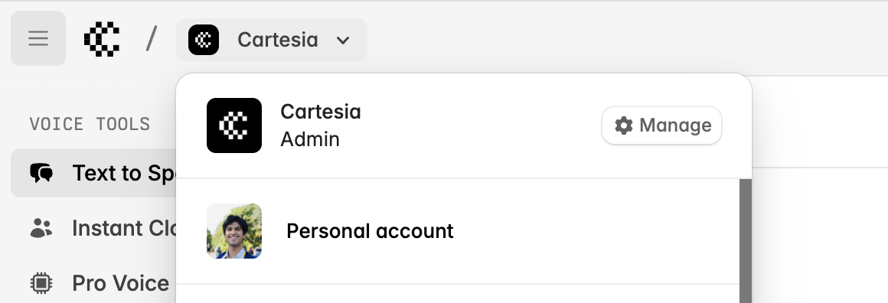

Cartesia supports two types of workspaces in its dashboard:

1. **Personal account (default):** The "Personal account" workspace is a user's unique, individual space, independent of any organization.
2. **Organizations:** Organization workspaces enable collaboration between multiple team members, who share the same view of all resources except playground generation history and starred voices, which are per-user in the organization.

<Warning>
	Organizations are not eligible for free credits, and must be upgraded to Startup tier or above before team members can be invited. Once you upgrade your organization, you can invite unlimited users to it for free.
</Warning>

<Steps>

### Create an organization

You can create an organization by going to the playground at [https://play.cartesia.ai](https://play.cartesia.ai), selecting the workspace switcher, and clicking **Create organization**.

<Frame background="subtle">
  
</Frame>

This will bring up a dialog where you can name your organization and upload a logo.

<Frame background="subtle">
  
</Frame>

Once you hit "Create organization", you will be redirected to the billing page to upgrade the organization to a higher tier. Organizations must be upgraded to the Startup tier or above before team members can be invited.

### Invite your team

Once you've upgraded your organization, you can use the "Manage" button in the workspace switcher to manage it:

<Frame background="subtle">
  
</Frame>

This pops up a modal where you can change your profile and invite your team:

<Frame background="subtle">
  
</Frame>

You can invite unlimited team members in a paid organization.

### Create voices, API keys, and other resources in your organization

Once you create and upgrade an organization, you can create voices, API keys, and more in the organization. They will be available to all users in the organization. The only exceptions are playground generation history and starred voices, which are per-user in the organization.

</Steps>

## Migrating from a single enterprise account with multiple linked emails to an organization

<Tip>

This migration path is mainly for users who have already created voices and API keys in a multi-email account and are using them in production. If this does not apply to you, we can directly migrate your voices to your organization.

</Tip>

Prior to organizations, we recommended linking each team member's email to a single Cartesia account to share resources like voices and API keys. This will continue to be supported, but we recommend migrating to organizations as it makes access control easier.

Because voices from multi-email accounts are not accessible with your organization's API keys, you cannot simply change your production API key to use your organization's API key. Instead, we recommend working with us to migrate your voices to your organization. Here's what the migration process looks like:

<Steps>

### Follow the guide above to create an organization and invite your team

### We temporarily allow your voices to be accessible with your organization's API key

Let us know that you've created an organization, and we'll temporarily allow your voices to be accessible using your organization's API key.

Note that these voices will _not_ be visible on the playground, but they will be accessible to your organization via the API.

### Test that you can access your voices using your organization's API key

We recommend testing that you can access your voices using your organization's API key using the following script:

```python
from cartesia import Cartesia  # pip install cartesia
import os

client = Cartesia(api_key=os.getenv("CARTESIA_API_KEY"))  # your *organization* API key (not the multi-email account's API key!)

voice_ids = [
    # list of voice IDs you're using in production
]

for voice_id in voice_ids:
    voice = client.voices.get(id=voice_id)
    print(voice.name)
```

If this script runs successfully, proceed to the next step.

### Change your production API key to use your organization's API key

Once you've tested that you can access your voices using your organization's API key, you can change your production API key to use your organization's API key.

### We transfer the voices to your organization

We will fully transfer the voices to your organization, rendering them inaccessible to you via the old multi-email account's API key.

### Remove extra emails from the multi-email account

Once the migration is complete, you can remove the extra emails from the multi-email account.

</Steps>

## Migrating billing

<Note>
If you are on the Enterprise plan, reach out and we will migrate your current subscription to an organization account for you.
</Note>

1. Each workspace has its own billing and credit limits, so you will need to check out again as the organization and then cancel your personal account subscription.
2. After you cancel, you have until the end of your current billing period to transfer all production-critical resources to your organization and issue and use new API keys from the organization.
