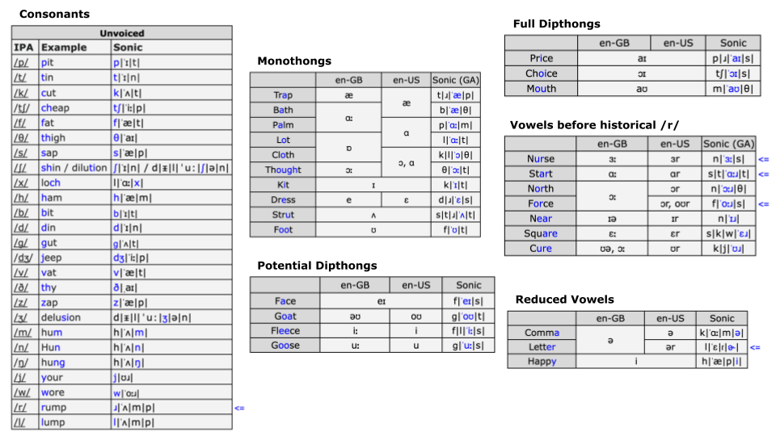

# Custom Pronunciation Guide

## How to insert phones

When using Sonic (whether through the playground, API, or client library) you can directly add Sonic-flavored IPA phones in the transcript. Just wrap them in `<<>>` and append each phoneme with a pipe `|`.

## Sonic-flavored IPA

We've compiled a pronunciation guide for the style of IPA that works most effectively with Sonic.

Notice - our model follows [Wikipedia](https://en.wikipedia.org/wiki/English\_phonology) style for most phones, but in spots where our model requires different notation than you may expect, we've included a blue <mark style="color:blue;">`<=`</mark> in the margins.

You can copy/paste some of these uncommon symbols from the original [charts here](https://docs.google.com/spreadsheets/d/1OJbiKtxLyodpNPqVfOu43X2HloLsAixTtFppEuQ\_4pI/edit?usp=sharing).

<figure><figcaption>
Examples can be helpful when transcribing phones for a new word
</figcaption></figure>

## Stresses and vowel length markers

Our model requires stress markers for first (`ˈ`) and second (`ˌ`) stressed syllables, which go directly before the vowel. We also use annotations for vowel length (`ː`). The model can also operate without them, but you will have noticeably better robustness and control when using them.&#x20;

## Usage example

Original input: `"transcript": "Can I get jalapeño on that?"`

Transformed input: `"transcript": "Can I get <<h|ɑː|l|ˈə|p|eɪ|n|y|ˌoʊ|>> on that?`

